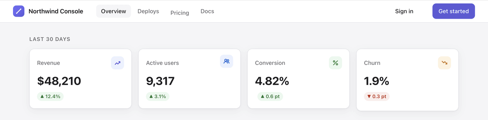

# Aligner

A macOS menu-bar app for checking alignment in any app: hold **⇧** and drag to
lay a guide line across the screen. Lines snap to the edges of whatever is on
screen — buttons, cards, icons, inputs — and once a line is on an edge, Aligner
follows it and shows you every other edge that lines up, and every one that
almost does.



*Two guides over the [demo page](demo/index.html): cyan marks edges that sit on
the line, orange marks the one that's 4 pt off.*

## Install

```sh
git clone git@github.com:axelniklasson/aligner.git
cd aligner
./build.sh install     # builds and copies Aligner.app to /Applications
```

Requires macOS 14+ and Xcode (or the Command Line Tools); it's a plain SwiftPM
package. `./build.sh run` launches from `./build` instead of installing. To
start Aligner at login, add it under *System Settings → General → Login Items*.

On first launch macOS asks for **Screen Recording** access — that's what the
edge snapping reads. Grant it and relaunch; everything else works without it.

## Use

| Action | How |
| --- | --- |
| Draw a guide | Hold ⇧, drag |
| Move a guide | Hold ⇧, drag it |
| Extend, shorten or re-angle a guide | Hold ⇧, drag one of its endpoint handles; the other end stays put. Keep ⇧ held to snap the angle to 45°, release it mid-drag to move freely |
| Stretch a guide across the screen | Hold ⇧, double-click it |
| Skip edge snapping for one drag | Hold ⌘ mid-drag |
| Undo the last guide | Double-tap ⇧ · menu · ⌃⌥⌘Z |
| Clear all guides | Triple-tap ⇧ · menu · ⌃⌥⌘C |
| Change colour, thickness, dash style | Menu-bar ╱ → *Color* / *Thickness* / *Style* (applies to the next guide) |
| Use a different key than ⇧ | Menu-bar ╱ → *Draw While Holding* |
| Pause (⇧-clicks reach apps again) | Menu-bar ╱ → uncheck *Enabled* |

The full list lives under *Help* in the menu.

While drawing, the crosshair means "drawing", an open hand means "grab to
move", and the endpoint handles appear when you hover a guide. Guides are
placed *just outside* the edge they snap to, on the side you approached from,
so they never cover the pixels you're checking.

## Try it on the demo page

[`demo/index.html`](demo/index.html) is a realistic dashboard with **twelve
planted misalignments** of 4–6 px — a button that's taller than its neighbour,
an icon that sits high, a column header that doesn't line up with its cells.

```sh
./build.sh demo        # builds, launches Aligner, opens the demo page
```

Hunt for them with guides, then press **R** to reveal them all with their
offsets. Open the page with `#reveal` in the URL to start revealed.

## How snapping works

Aligner takes a screenshot of the display you're drawing on when you press the
mouse (and while you hover with ⇧ held) and looks for luminance edges: a pixel
boundary counts when a same-direction step runs through the cursor for at least
12 pt, is a local maximum across neighbouring boundaries, and isn't part of a
plateau. That keeps anti-aliased edges, hairlines and thin borders and rejects
text, gradients and soft shadows.

- The anchor of a new guide snaps to the nearest horizontal and vertical edge
  within 6 pt; a moved guide snaps to parallel edges; a dragged end snaps to
  the edge it's about to cross.
- With the guide on an edge, the whole span is scanned along that boundary.
  Other edges on it are highlighted in cyan; edges of other elements within
  8 pt but off the line are marked in orange with their offset.

Only the current display is captured, once per mouse-down; nothing is stored.
The overlay itself is excluded from the capture so your own guides never count
as edges.

### Keeping the permission across rebuilds

macOS ties the Screen Recording grant to the app's code signature, and an
ad-hoc signature changes with every build, so a rebuilt Aligner has to be
re-granted. Create a self-signed certificate once and `build.sh` will use it:
Keychain Access → *Certificate Assistant → Create a Certificate…*, name
**Aligner Dev**, Identity Type *Self-Signed Root*, Certificate Type *Code
Signing*. (Or set `ALIGNER_SIGN_IDENTITY` to any identity's name.)

## Under the hood

One transparent, borderless, non-activating `NSPanel` per display sits at the
screen-saver window level and ignores mouse events. A 60 Hz timer reads the
hardware modifier state via `CGEventSource.flagsState` — no Accessibility or
Input Monitoring permission needed — and while the draw modifier is the only
modifier held, the panels stop ignoring mouse events and capture the drag.
Guides are stored in global screen coordinates so they survive display changes.

```
Sources/Aligner
├── AppDelegate.swift      menu bar, settings, permission flow, overlay lifecycle
├── OverlayWindow.swift    the per-display panel and its capture toggle
├── OverlayView.swift      drawing, hit-testing, drag model, snapping, highlights
├── EdgeMap.swift          luminance snapshot of a display (+ coordinate mapping)
├── EdgeDetector.swift     edge finding: candidates near a point, segments along a boundary
├── SnapEngine.swift       edges → snapped coordinates, "just outside" placement
├── ScreenSampler.swift    ScreenCaptureKit capture excluding our own windows
├── Snap.swift             45° angle snapping
├── Geometry.swift         segment distance, extend-to-edges
├── TapDetector.swift      double/triple-tap of the modifier
├── ModifierWatcher.swift  polls modifier flags
├── HotKeyCenter.swift     Carbon global hotkeys
├── LineStore.swift        the guides
├── LineStyle.swift        colour / width / dash, persisted settings
├── DrawModifier.swift     which key enters drawing mode
└── DebugSelfTest.swift    ALIGNER_DEBUG diagnostics and the demo recorder
```

## Development

```sh
swift test             # detector, snap engine, tap detector, geometry
./build.sh run         # rebuild and relaunch
```

Diagnostics run when the binary is started with `ALIGNER_DEBUG=1`:

| Variable | Effect |
| --- | --- |
| `ALIGNER_DEBUG=1` | Logs capture and drag events; asks the window server which window would get a click with capture on and off |
| `ALIGNER_DEBUG_DUMP=<png>` | Draws sample lines and renders the overlay to a PNG |
| `ALIGNER_DEBUG_CAPTURE=<png>` | Captures the display through the snapping pipeline and logs the edges along the screen's centre lines |
| `ALIGNER_DEBUG_SNAPTEST=1` | Drives the overlay with synthesized mouse events and checks the committed line against `SnapEngine` |
| `ALIGNER_DEBUG_GIF=<dir>` | Records the demo GIF: open `demo/index.html#stage` in a browser first, frames land in `<dir>` for ffmpeg |

The GIF above was made with the last one:

```sh
"/Applications/Google Chrome.app/Contents/MacOS/Google Chrome" --user-data-dir=/tmp/aligner-demo \
  --no-first-run --window-size=1200,760 --window-position=120,140 --app="file://$PWD/demo/index.html#stage" &
ALIGNER_DEBUG=1 ALIGNER_DEBUG_GIF=/tmp/aligner-frames ./build/Aligner.app/Contents/MacOS/Aligner
ffmpeg -framerate 10 -i /tmp/aligner-frames/frame%04d.png \
  -vf "scale=1200:-1:flags=lanczos,split[a][b];[a]palettegen=stats_mode=diff[p];[b][p]paletteuse=dither=sierra2_4a:diff_mode=rectangle" \
  -loop 0 demo/aligner.gif
```
